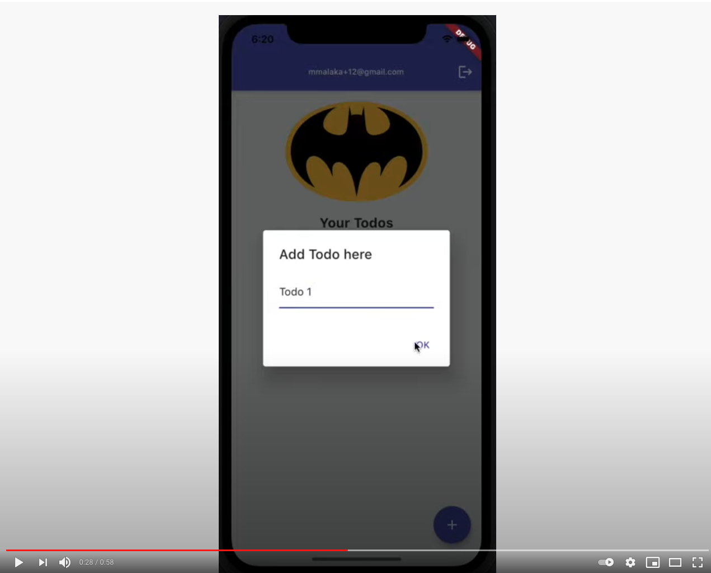

# A Flutter Todo App using AWS Amplify & GetX

A simple To-Do List app created using AWS Amplify and GetX.

- [Read about it here](https://dev.to/offlineprogrammer/a-flutter-todo-app-using-awsamplify-getx-2oii)

With this project you will learn how to:

1. Use AWSAmplify Auth.
2. Use AWSAmplify DataStore.
3. Manage the state of the application using GetXController.
4. 4. Make the UI reactive efficiently, rebuilding only the necessary widgets.

YouTube video demo here: 

